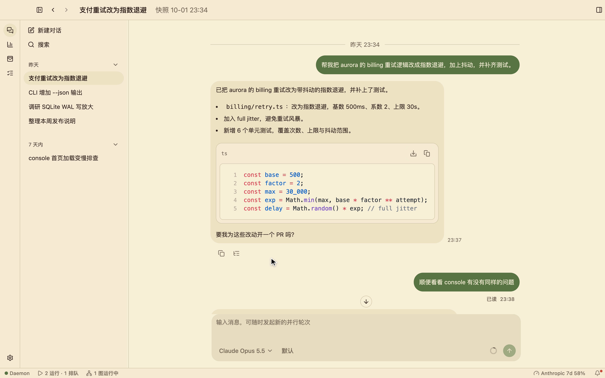
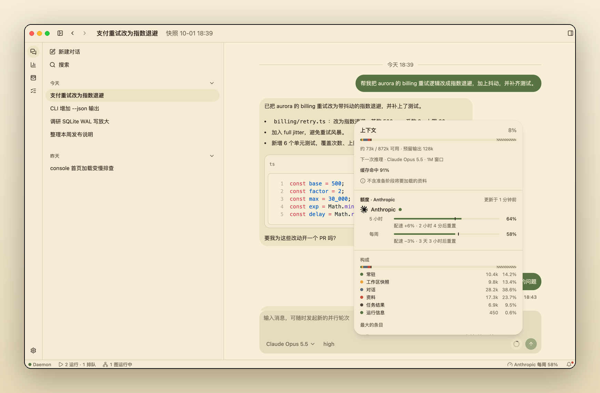
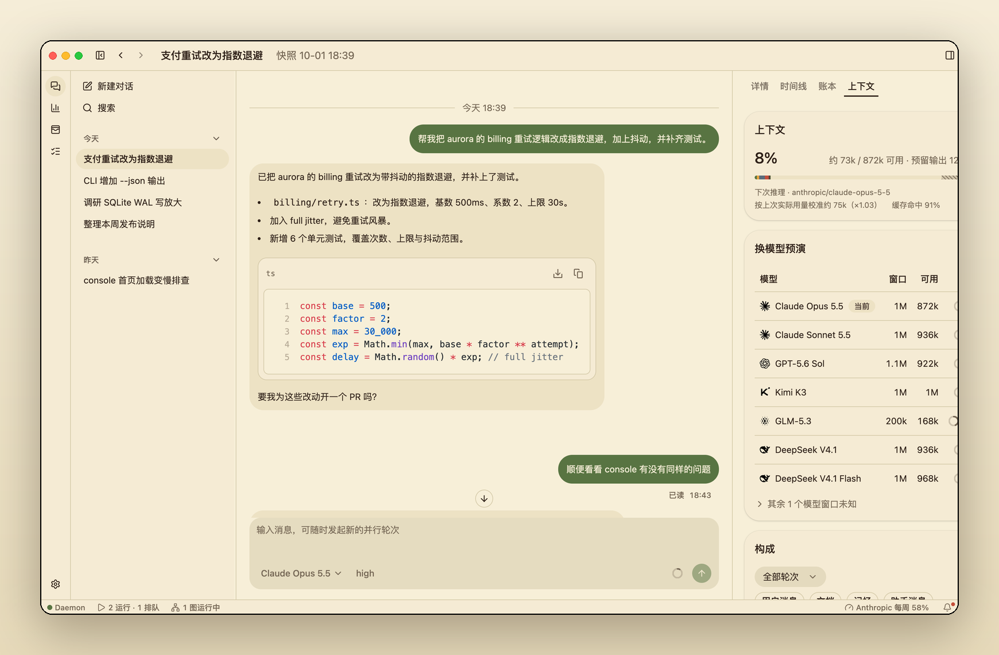
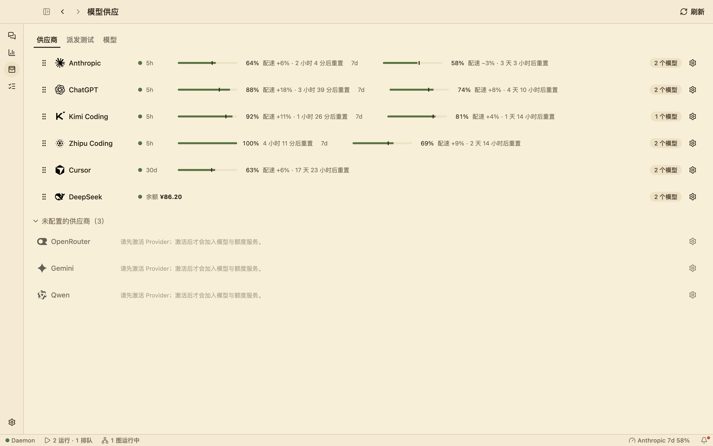
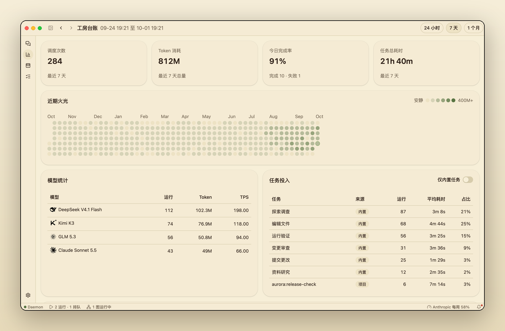

<div align="center">


# Wrenyard

**A local-first desktop workbench for orchestrating AI engineering work.**

One conversation reasons about the goal; exploration, edits, tests and commits
run as parallel tasks on the models you already pay for — with every token,
quota window and task visible.

[](https://github.com/wrenyard/wrenyard/releases)
[](LICENSE)


[中文](README.zh-CN.md) · [Download](https://github.com/wrenyard/wrenyard/releases)

</div>



> **Development preview.** Wrenyard ships rolling `1.0.0-dev.N` prereleases.
> It is used daily by its authors, but it is not a stable release yet — see
> [Status](#status).

## Why Wrenyard

- **Reasoning stays expensive, everything else stays cheap.** The main model
  only reasons and marks what should happen; cheap models and the task runtime
  gather context, dispatch work and write the reply.
- **Context you can audit.** A session is one append-only ledger. Before you
  send, Wrenyard shows how large the *next* reasoning request will be for the
  model you picked, what fills it, and how it has grown.
- **Your providers, your quota.** Claude, ChatGPT, Kimi, Zhipu, Cursor,
  DeepSeek and others sit side by side with remaining quota, pace and reset
  times. Task routing weighs price, speed, quota and capability automatically.
- **Local-first.** A local daemon owns tasks and state over owner-only IPC.
  Nothing is hosted for you, and nothing leaves your machine except the model
  requests you make.

## A tour

### Conversations that dispatch work

The session page is the main workspace. Each turn can fan out into `explore`,
`edit`, `test` and `commit` tasks across your projects; the timeline and the
raw ledger are one click away in the inspector.

### See the next request before you send it

The ring next to the send button shows the predicted context of the next
reasoning call against the selected model's usable window, the cache hit rate,
and the quota of that model's provider. Expand it for a breakdown, or open the
inspector for a full audit: composition by layer and item, growth per turn, a
preview across every model, and per-role call costs.

<table>
  <tr>
    <td></td>
    <td></td>
  </tr>
</table>

### Quota, pace and resets at a glance

The Model Supply page lists every provider on one compact line: remaining
quota per window, a pace marker that shows whether you are burning faster than
an even rate, and the time until reset. The status bar always shows the
tightest window and warns before you run out.



### A ledger of the work

The Workshop Ledger summarises dispatches, token use, completion rate and task
time, with a year-long activity heatmap and per-model and per-task breakdowns.



### Make it yours

Two built-in themes — the warm **Paper** and the shadcn-style **Neutral** — each
in light and dark, following the system or set by hand. Settings are searchable
and laid out like an editor's settings page.


## Install

Download the installer for your platform from the
[releases page](https://github.com/wrenyard/wrenyard/releases):

| Platform | File |
| --- | --- |
| macOS (Apple Silicon) | `wrenyard-desktop-<version>-darwin-arm64.dmg` |
| Windows (x64) | `wrenyard-desktop-<version>-win32-x64-setup.exe` |

The app bundles everything it needs: the `wrenyard` CLI, a Node runtime and the
daemon.

**First launch.** Preview builds are ad-hoc signed on macOS and unsigned on
Windows, so the OS asks once:

- **macOS** — open *System Settings → Privacy & Security* and choose
  *Open Anyway*.
- **Windows** — on the SmartScreen prompt choose *More info → Run anyway*.

**Updates.** The app checks the update feed, verifies the download's SHA-256
and installs it when you choose. Quit the app fully from the menu bar or tray
for an update to apply.

## Command line

The same `wrenyard` command ships inside the app (on Windows the installer can
add it to `PATH`). Every business command accepts `--json`.

```text
wrenyard desktop                 launch the desktop app
wrenyard daemon run|stop|status  run or inspect the local control plane
wrenyard task list|describe|run  delegate and track project work
wrenyard quota [provider]        provider quota
wrenyard project …               registered projects and their worktrees
wrenyard exec <prompt> --target  one-off agent execution
wrenyard taskgraph …             task graphs for multi-step work
wrenyard doctor                  check the local install
```

The CLI never starts a daemon on its own: open the app, or run
`wrenyard daemon run` in a terminal.

Seven built-in task roles share one runtime and automatic model selection:

| Task | Use it to |
| --- | --- |
| `explore` | investigate code, history, logs and failures |
| `edit` | apply bounded file changes |
| `test` | run verification and report evidence |
| `code-review` | review correctness against requirements |
| `commit` | create verified local commits |
| `librarian` | research external documentation |
| `oracle` | think through hard trade-offs |

Projects can add their own tasks next to these.

## Build from source

Requirements: Node.js ≥ 24.19 and pnpm 11.19 (via `corepack enable`).

```sh
git clone https://github.com/wrenyard/wrenyard.git
cd wrenyard
pnpm install --frozen-lockfile
pnpm dev        # daemon + desktop with hot reload
```

`pnpm dev` refuses to start next to a running daemon, so quit the installed app
first. See the [development guide](docs/development.md) for the dev loop, shared
data directories and release packaging, and read
[CONTRIBUTING.md](CONTRIBUTING.md) before opening a pull request.

## Repository layout

```text
apps/desktop     the desktop app (Electron + React, shadcn/ui, Tailwind)
apps/daemon      the local control plane: tasks, task graphs, sessions, gateway
apps/cli         the wrenyard command
packages/        features (session, providers, quota, routing, exec, …),
                 protocol, clients, execution primitives and themes
tools/           checks and release tooling
docs/            architecture, development and release notes
```

Read more in [docs/architecture.md](docs/architecture.md).

## Status

Wrenyard publishes rolling `1.0.0-dev.N` prereleases for macOS (Apple Silicon)
and Windows (x64). Before a stable release it still needs trusted code signing
([signing notes](docs/release/signing.md)), wider clean-machine testing and a
documented compatibility policy. Nothing is published to npm.

## Documentation

- [Architecture](docs/architecture.md)
- [Development guide](docs/development.md)
- [Task graphs](docs/taskgraph.md)
- [Contributing](CONTRIBUTING.md) · [Security](SECURITY.md) · [Changelog](CHANGELOG.md)
- [Upgrade notes for early previews](docs/history/migration.md)

## License

[MIT](LICENSE). Third-party notices are in
[THIRD_PARTY_NOTICES.md](THIRD_PARTY_NOTICES.md) and are verified by
`pnpm check`.
